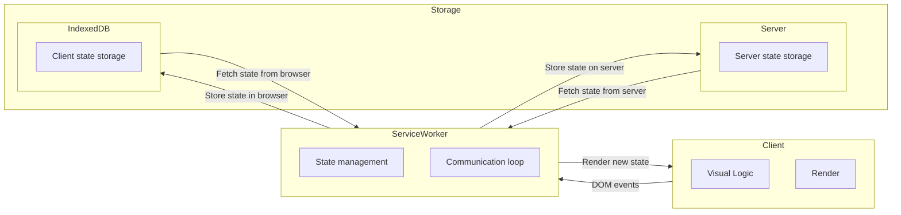

# Gobaith - a mental health tracker

A flexible mental health tracker for developers.

Many other trackers exist. This is mine. I have used it for a long time (multiple years) and have open sourced it for others to use and adapt as they need.

*Non-developers probably should look at other existing tracker apps, rather than using this one. There's lots on the app stores.* This tracker comes with flexiblity at a cost in terms of how easy it is to use.

You are expected to modify the tracking to adapt to your needs. The default tracking is suitable for those with mood disorders, or psychotic disorders.

## Screenshots

Some screenshots based on generated data (no real human's tracking, see the [generator](./src/utils/data.ts). There is more functionality and visualizations within the app, so the best way to understand is to try it out yourself.


## Design principles

### Adaptability

Everyone's condition is their own. What each person wants to track will be different as a result, and it should be as easy as possible to adapt to their needs.

### Simplicity of journaling

For data to be useful, it has to exist. Therefore in this app, I've made it as easy as possible to enter a day's record so that it does not take up much time from the day.

### No analysis provided

You, your doctors, and your support network are the only ones who understand your exact condition. Therefore this app does not provide any analysis or commentary on your symptoms. It does provide multiple ways to view and interact with the data, but any meaning from the data is up to you to decide.

### No AI

AI can be used to discuss medical issues, however the person you should really be talking to are licensed professionals. As a result, I have not build AI into this project. It would be trivial to do so if you wanted to, but again, if you are having serious symptoms you should talk to a medical professional.

Additionally, all code in this repo was written by me, a human.

### Data ownership

Your tracked data is yours. Therefore, this app does not limit you from having access to it in any way. There are multiple ways to export and import the data. Additionally, the data is not shared with any 3rd parties, and there are no telemetrics of any kind.

### No notifications

Many apps provide notifications specifically for a tracker app. I instead built the habit over time by filling the tracker at the same time I take my medications, which I already had a notification for.

### Avoid dependencies

A core tool that you use every day should not need constant maintenance to keep running. Therefore this app uses minimal dependencies. The frontend itself only uses Chart.js, and two CSS frameworks (Pico and Pure.css). The backend only uses Express.

## Install

```
npm install ts-node
npm install
```

## Run

You can run it either:
- Without a backend (which then uses IndexedDB for storage)
- With a backend (that stores json on-device, and uses IndexedDB in the client for caching)

### Without a backend

```
npm run build
cd web
python3 -m http.server
```

### With a backend

```
npm run serve
```

## Tests

There are some Playwright tests, which will be added to over time.

```
npm run build
npm run test
```

## Generate fake data

The [data](src/utils/data.ts) script is intended for generating some sample data to help with development.

## Architecture

This diagram represents the rough architecture:



There is a degree of separation, where all the state management is offset to the service worker. This is intended so that it is easy to replace with a backend if you desire.

To begin with changes, I suggest checking out the [types](./src/types.ts) file, followed by the main [index](./src/index.ts) file. Service worker logic can be found in [server-worker.ts](./src/service-worker.ts). Most changes should be enforced by the type system, so if you're not sure: run `tsc --noEmit`.

## Future plans

- Add more Playwright tests
- Release electron wrapper
- A way to sync between mobile/desktop

## Support

I cannot help you with your mental health, but I can help you to help yourself. I will be keeping this project up to date the best I can. Feel free to open an issue if you are stuck with some code or functionality, and open a PR if you want to improve something.

## Licensing

I've licensed this as AGPL, as I hope to help other developers who have had similar experiences. Changes made for your own purposes do not need to be open, but any changes towards end-users (i.e beyond your personal needs) must be openly distributed.

All code in this repo was written by me, a human, except for Pure.css and Pico.css. They have been vendored with their licensing intact. I originally wrote this around 6 years ago, and updated it to TypeScript while preserving the same functionality.

Any similarities in UI to other products are superficial, either through inspiration or coincidence, and no code or logic has been taken from any other sources.

## Name

Gobaith means hope in Welsh. Tracking my health gave me hope. I hope it will give you too.
